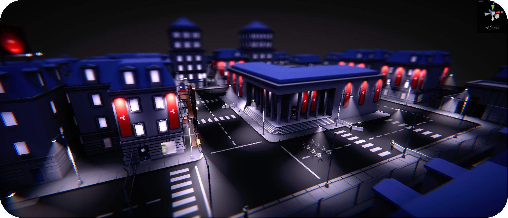
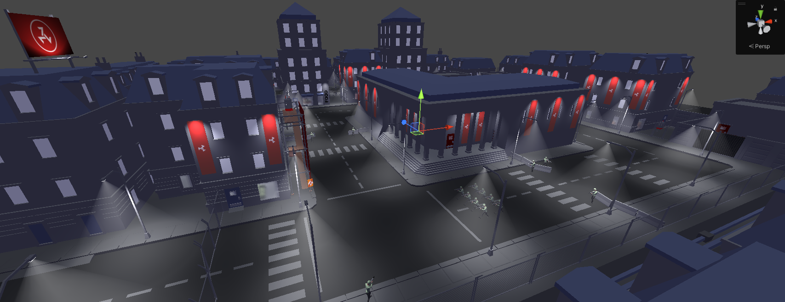
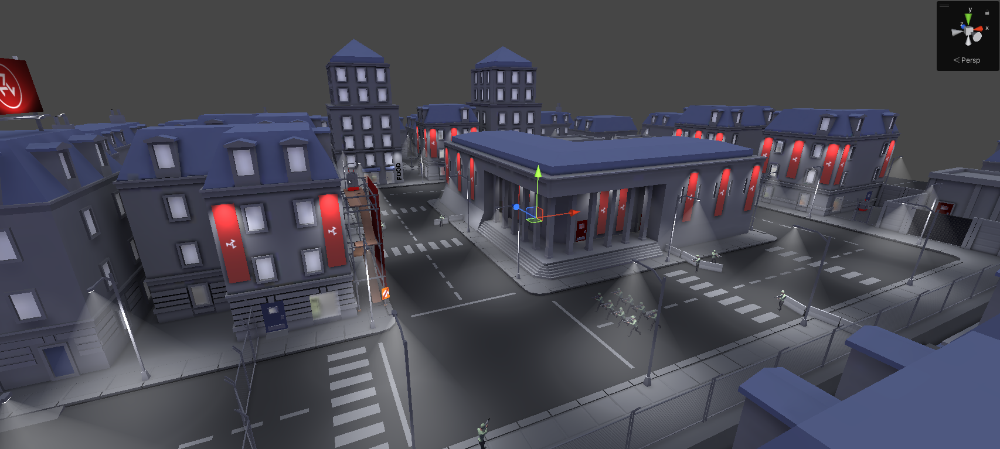
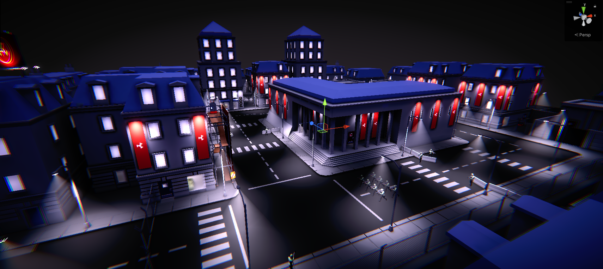
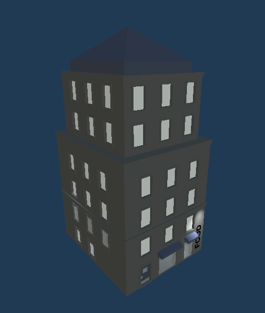
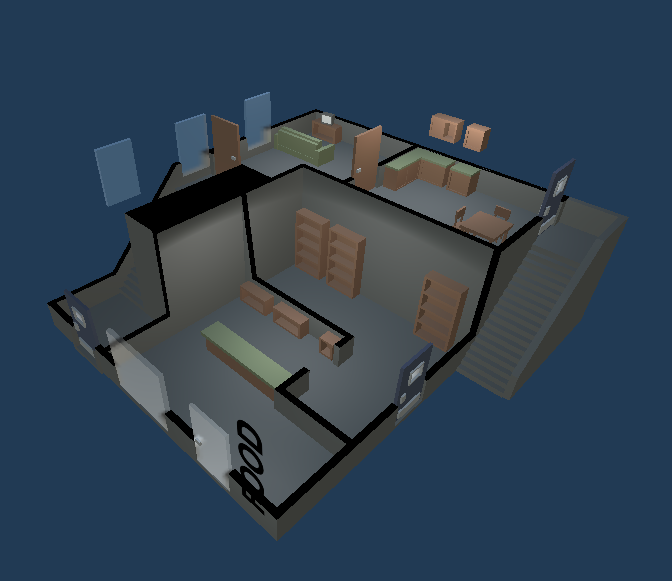
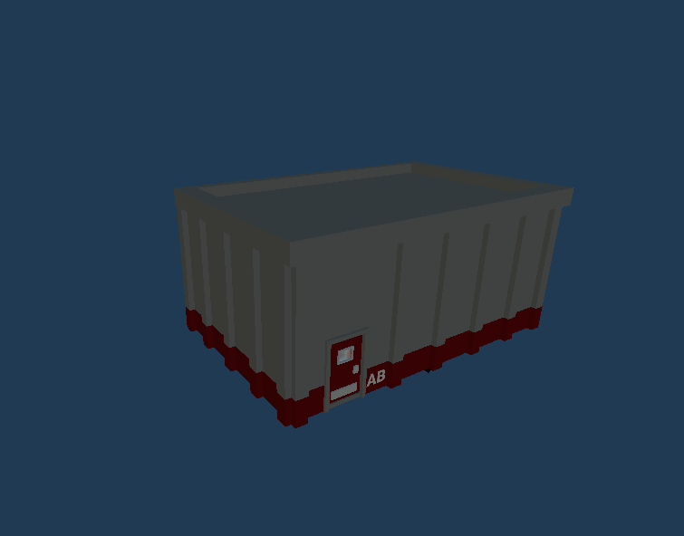
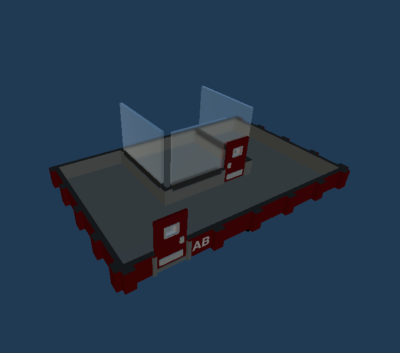
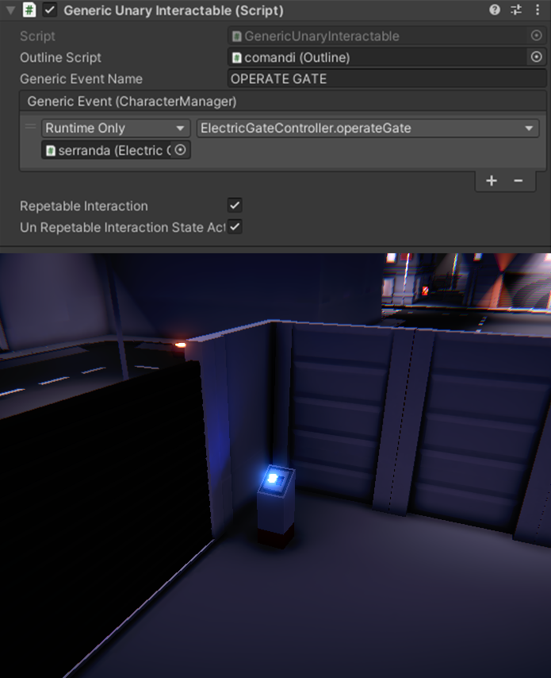

# Devlog(Diario di sviluppo issue 23)

## Applicazione effetti Post processing + Bake illuminazione
Per raggiungere il concept visivo desiderato sono stati applicati effetti: Vignette, Bloom, Color Adjustments, Chromatic Aberration, Tonemapping, White Balance. Sono state inoltre settate le impostazioni per il Bake dell'illuminazione. Tutti i modelli poligonali che ho progettato ed esportato con Blender sono predisposti per il calcolo dell'illuminazione(UV Mapping)

### Baked lighting: OFF, Post processing: OFF

### Baked lighting: ON, Post processing: OFF

### Baked lighting: ON, Post processing: ON

&nbsp;

## Nuovi edifici
Modellazione, UV Mapping, applicazione materiali

### Edificio civile 2
|  |  |

### Edificio militare 1
|  |  |

&nbsp;

&nbsp;

---

&nbsp;

&nbsp;

## Meccaniche di gioco e strumenti di interazione
### Sabotaggio task degli NPC
Sono state implementate delle meccaniche per sabotare i task degli NPC riutilizzando il codice già sviluppato(Interactable Objects e Weapon Item)

&nbsp;

### Interaction Console (level design)
Progettate le interaction console. Le interaction console sono dei gameObject che permettono di esporre delle interaction ai character o NPC della mappa(interactable objects) e di associare degli eventi alle singole interaction create. In questo esempio l'evento dell'apertura di un cancello.
Gli eventi supportati sono a singolo stato e doppio stato, questi possono essere ripetibili o meno.

&nbsp;

### Gate zone militari
Progettate animazioni e stati del gate.
Sabotando/sovraccaricando i generatori elettrici verranno aperti tutti i gate delle basi militari. Questi si richiuderanno automaticamente quando tornerà l'energia elettrica(timer).

&nbsp;

&nbsp;

---

&nbsp;

&nbsp;

## Implementazione sistema shooting dei characters e inventario

### Outline character mirati
Quando il character player(controllato dall'utente) mira un character viene visualizzato un outline sulla sua mesh. Consente di distinguere le varie categorie dei character(civili, nemici)
