# Devlog Capitolo 3(Diario di sviluppo issue 23)

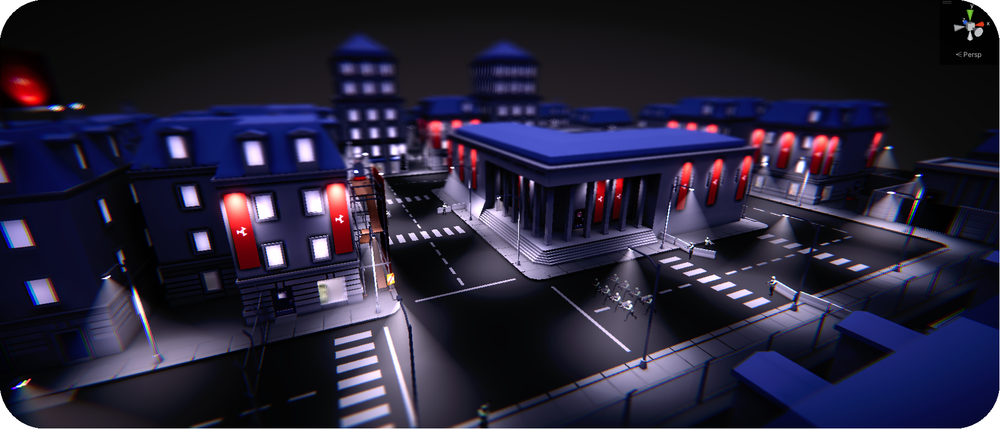
- Bake illuminazione + Post processing
- Completamento dello scenario(edifici)
- Meccaniche sabotaggio
- Console programmabili(level design)
- Gate militari
- Avanzamento completamento level design e mappa di gioco
- Implementata gravità character

&nbsp;

&nbsp;

---

# Applicazione effetti Post processing + Bake illuminazione
Per raggiungere il concept visivo desiderato sono stati applicati effetti: Vignette, Bloom, Color Adjustments, Chromatic Aberration, Tonemapping, White Balance. Sono state inoltre settate le impostazioni per il Bake dell'illuminazione. Tutti i settaggi dei PP e dell'illuminazione scelti sono visualizzabili da editor. Tutti i modelli poligonali progettati ed esportati con Blender sono predisposti per il calcolo dell'illuminazione(UV Mapping)

## Baked lighting: OFF, Post processing: OFF
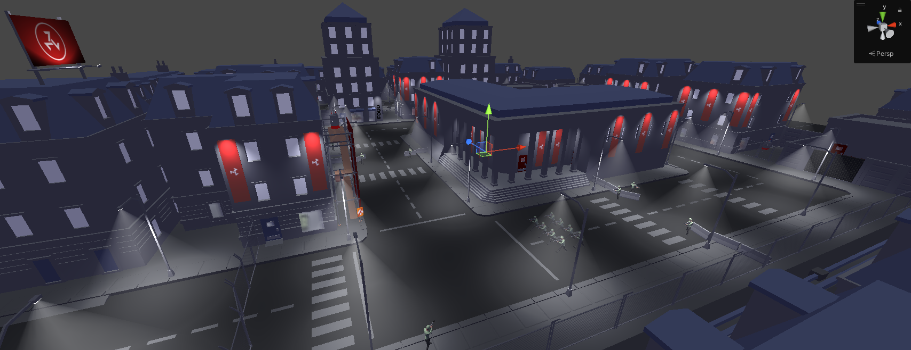

## Baked lighting: ON, Post processing: OFF
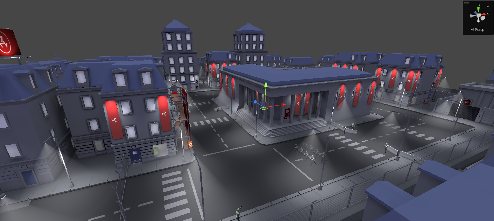

## Baked lighting: ON, Post processing: ON
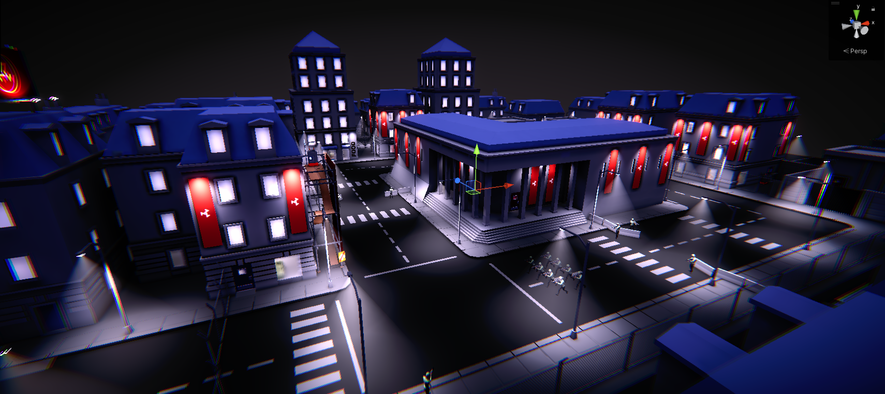

&nbsp;

# Nuovi edifici
Modellazione, UV Mapping, applicazione materiali

## Edificio civile 2
| 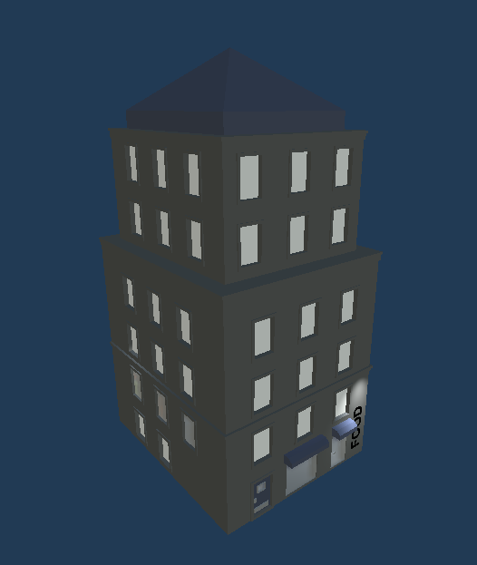 | 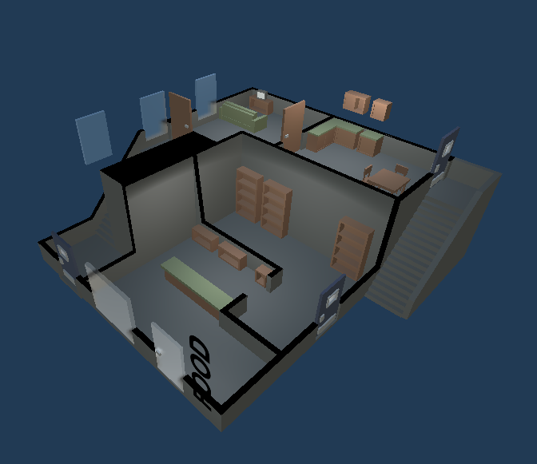 |

## Edificio militare 1
| 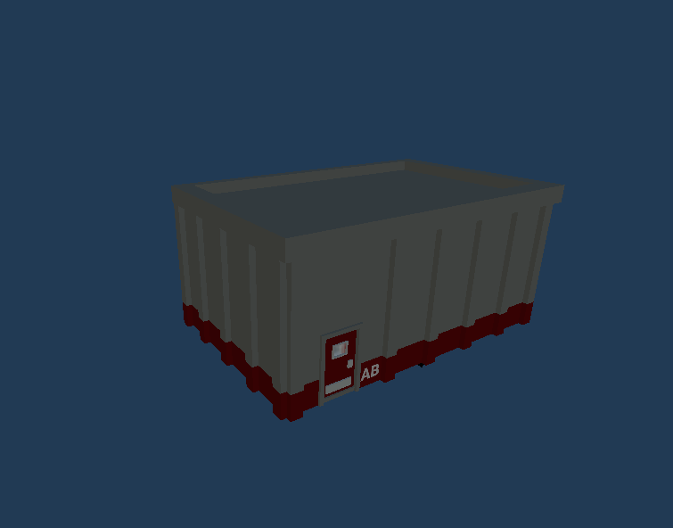 | 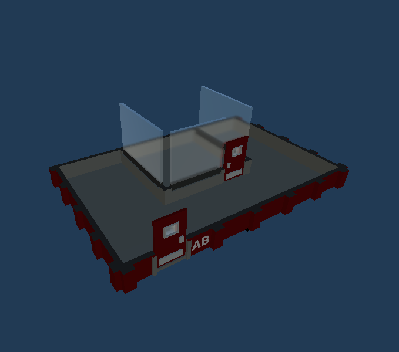 |

&nbsp;

&nbsp;

---

&nbsp;

&nbsp;

# Meccaniche di gioco e strumenti di interazione
## Sabotaggio task degli NPC
Sono state implementate delle meccaniche per sabotare i task degli NPC riutilizzando il codice già sviluppato(Interactable Objects e Weapon Item)

&nbsp;

## Interaction Console (level design)
Progettate le interaction console. Le interaction console sono dei gameObject che permettono di esporre delle interaction ai character o NPC della mappa(interactable objects) e di associare degli eventi alle singole interaction create. In questo esempio l'evento dell'apertura di un cancello.
Gli eventi supportati sono a singolo stato o a doppio stato, questi possono essere ripetibili o meno.

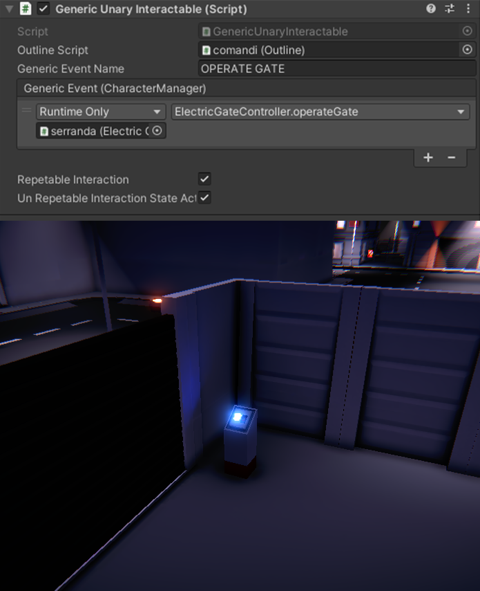

&nbsp;

## Gate zone militari
Progettate animazioni e stati del gate.
Sabotando/sovraccaricando i generatori elettrici verranno aperti tutti i gate delle basi militari. Questi si richiuderanno automaticamente quando tornerà l'energia elettrica(timer).

&nbsp;

## Espedienti Gate bugs
Per evitare che il player utente possa sfruttare il collider del gate per scavalacare o accedere a zone non consentite, viene azionato un collider alla chiusura del gate che sposta il player oltre la chiusura del gate.

&nbsp;

## Gate NavMesh Obstacle
Applicato il Navmesh Obstacle sul gate per ostacolare o liberare in tempo reale il percorso di un NavMesh Agent

&nbsp;

&nbsp;

---

&nbsp;

&nbsp;

# Miglioramenti

## Implementata forza di gravità character giocato
- Implementato "GroundCheck" permette tramite un raycast rilevare se il character del player "isGrounded".
- Se il player "is not Grounded" allora oltre che al vettore movimento, viene sommato anche il vettore della forza gravitazionale (Vector3.Down * 9.81)

| Senza gravità: | Con gravità: |
| ------------- |:-------------:|
| 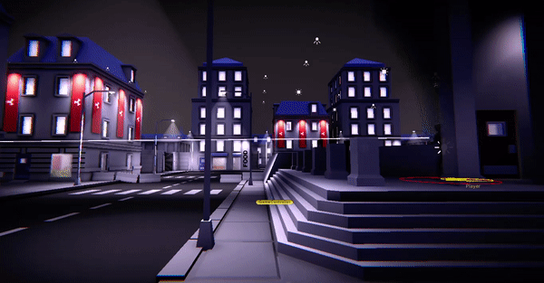 | 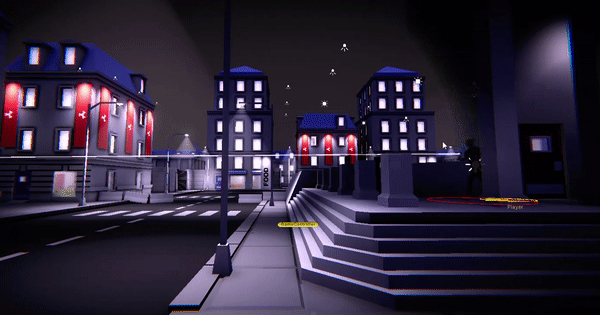 |

## Vari miglioramenti
- Applicati vari miglioramenti
- Risolti alcuni bug
- Controlli di mira e movimento ora sono più reattivi e precisi(usato Update al posto di FixedUpdate)
