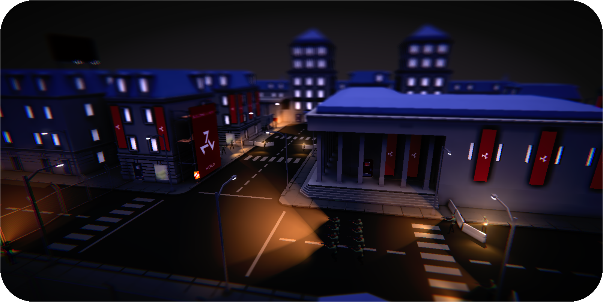
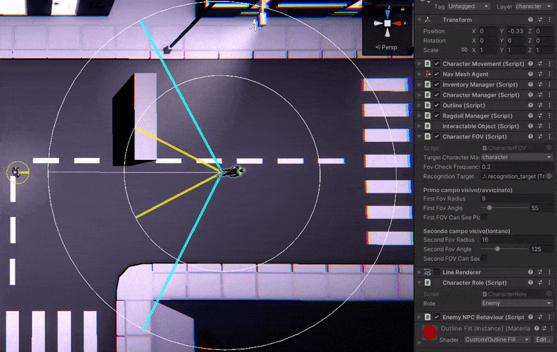
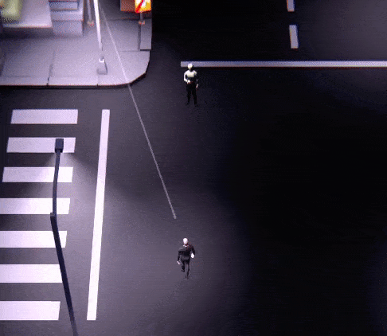
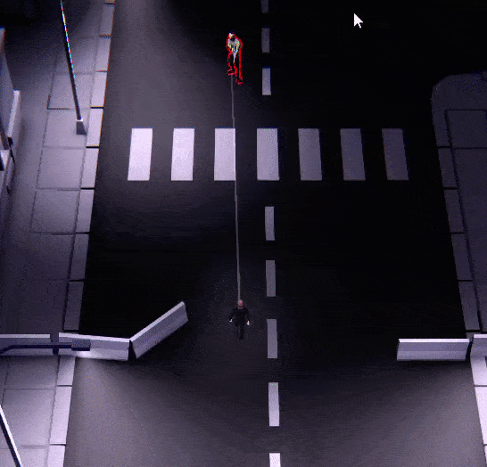
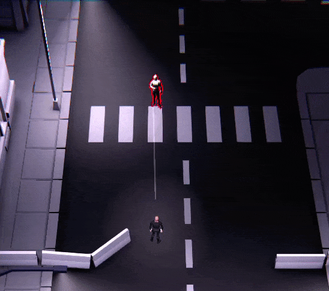
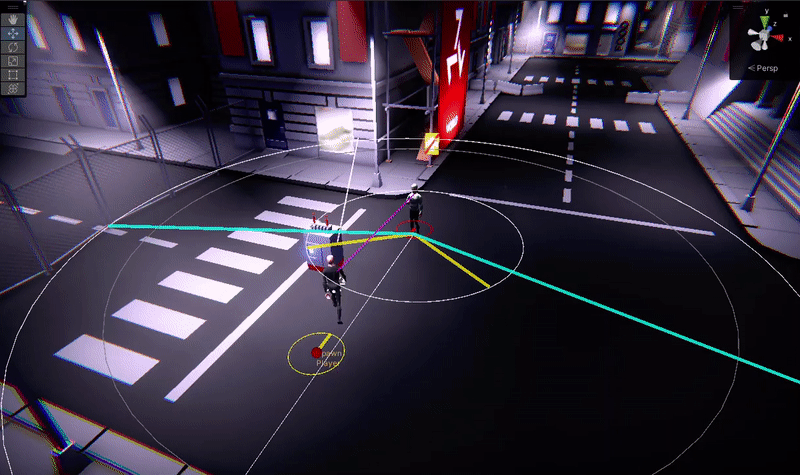
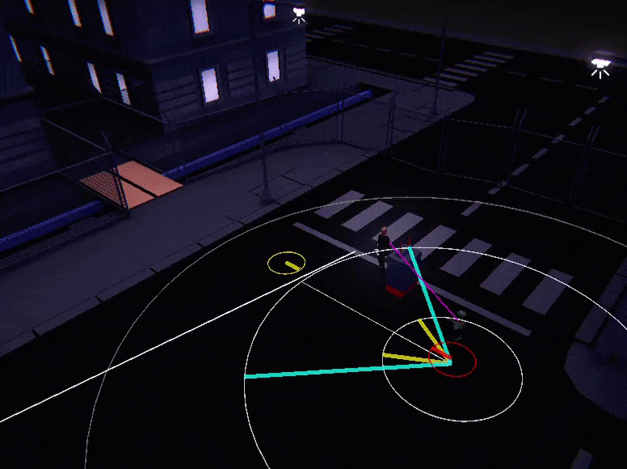

# Devlog Capitolo 4(Diario di sviluppo issue 10)

- "CharacterFOV". Implementa tramite un doppio Field Of View la rilevazione del character player
- Attivazione degli stati di allerta in base all'area del FOV usando i check **"isCharacterInProhibitedAreaCheck"**, **"isUsedItemProhibitedCheck"**, **"isCharacterWantedCheck"**
- Comunicazione locale e globale degli stati di allerta

&nbsp;

&nbsp;

---

# FOV NPC Characters
> Sia il **character NPC A** tale che non sia player

## CharacterFOV trigonometria a gogo part. 2
Sviluppato questo componente per consentire agli NPC di rilevare ed intercettare l'utente giocatore.
I due campi visivi sono caratterizzati da due parametri: raggio e angolo visione.
I due campi visivi sono rappresentati con colori differenti, la prima(giallo-ravvicinato) e la seconda(ciano-distante).
Quando il player si trova in una di questi due campi visivi, viene utilizzato un raycast dal **character NPC A** al player (raycast magenta dal secondo FOV ciano-distante, raycast rosso dal primo FOV giallo-ravvicinato), se uno dei due raycast raggiunge con successo il character del player, **character NPC A** è riuscito ad intercettare il character player, altrimenti se il raycast viene interrotto da un ostacolo non sarà possibile intercettare il player.
Queste due aree quindi servono ad intercettare il player con 2 differenti livelli.
- Se il character del player viene intercettato tramite il secondo campo visivo(ciano-distante) dal **character NPC A**, allora il **character NPC A** avvierà alcuni check che stabiliranno se valutare il character del player come sospetto o meno.
- Se il character del player viene intercettato tramite il primo campo visivo(giallo-ravvicinato) dal **character NPC A**, allora **character NPC A** avvierà alcuni check che stabiliranno se valutare il character del player come ostile o meno.

&nbsp;

## Visualizzazione avanzata dei FOV da editor
Sono state implementate funzioni di visual debugging GIZMOS visualizzabili nell'editor di Unity, disegnando i parametri, raggio e angolo visione ed il raycast usato dai FOV per verificare la presenza di ostacoli tra il **character NPC A** e il player. Vengono visualizzati solo quando il player innesca uno dei due FOV.
Questi strumenti di visual debugging mi sono tornati molto utile al fine di testare e verificare il funzionamento dell'IA e degli stati di allarme.
- Primo FOV giallo-ravvicinato, raycast rosso
- Secondo FOV ciano-distante, raycast magenta

&nbsp;

## Area di allerta characters NPC
L'area di allerta è una terza area circolare che viene utilizzata per rilevare i Characters vicini al **character NPC A**. Da usare per simulare le comunicazioni di informazioni tra characters.

&nbsp;

# Attivazione stati di allerta e Behaviour NPC
> Sia il **character NPC A** tale che non sia player

L'attivazione di uno stato di allerta comporta l'interruzione instantanea del task che stanno eseguendo

&nbsp;

## Check(controlli) affinchè vengano impostati degli stati di allerta
Quando il character del player entra in uno dei due campi visivi(FOV) del **character NPC A**, vengono avviati dei check per verificare se il character del player è sospetto, ostile oppure nessuna delle due opzioni.
- Check **"isCharacterInProhibitedAreaCheck"**. Verifica se il character del player rilevato da **character NPC A** si trovi in un'area proibita //se il ruolo del character è abilitato all'accesso di una certa area
- Check **"isUsedItemProhibitedCheck"**. Verifica se il character del player rilevato da **character NPC A**  stia impugnando in modo esplicito (!weaponPuttedAway) un item non consentito(weaponItem ecc ecc)
- Check **"isCharacterWantedCheck"**. Verifica se il character del player rilevato da **character NPC A** sia ricercato o meno usando un dizionario // sistema dizionari

### Check "isCharacterInProhibitedAreaCheck"
Per realizzare la possibilità di controllore se un character si trovi in un'area proibita o meno, sono state realizzate le "CharacterArea" (trigger BoxCollider) con id univoco.
ed un CharacterAreaManager assegnato ad ogni Character NPC. Il CharacterAreaManager allo spawn dell'NPC assegnerà l'id dell'area in cui l'NPC è spawnato all'NPC stesso, questo consetirà di verificare se un certo NPC appartiene o meno ad una certa area e se una certa area è proibita o meno.
Il check "isCharacterInProhibitedAreaCheck" utilizza anche il ruolo dei character. Ad esempio le guardie nemiche possono accedere a tutte le aree. Invece i civili non potranno trovarsi in aree proibite o che non sono di loro appartenenza.

### **Stati di allerta provocati da equipaggiamento proibito** 

### **Stati di allerta provocati da area proibita** 

### **Stati di allerta provocati dall'essere ricercato** 

&nbsp;

## Stati di allerta

Gli stati di allerta di un **character NPC A** sono due.
Gli stati di allerta innescati sono visualizzabili con un'animazione punto esclamativo
- giallo per lo stato di allerta "SuspiciousAlert"
- rosso per lo stato di allerta "HostilityAlert"

&nbsp;

### **Passaggio diretto allo stato di allerta HostilityAlert** 
Se il character player ha già innescato lo stato di **SuspiciousAlert** del **character NPC A** questo può trasformarsi direttamente in stato **HostilityAlert** se il character del player **inizia a correre** o **inizia a sparare** nel secondo campo visivo ciano
| Passaggio diretto a **HostilityAlert** del **character NPC A** iniziando a correre: | Passaggio diretto a **HostilityAlert** del **character NPC A** iniziando a sparare: |
| ------------- |:-------------:|
|  |  |

### **SuspiciousAlert** 
Questo stato viene attivato quando almeno uno dei tre check è vero. 

1. Il timer dello stato ha una durata di x secondi.
2. Per tutto il tempo in cui il character si trova nel secondo fov ciano e se almeno uno dei check è vero, allora viene resettato il timer dello stato **SuspiciousAlert**
3. Durante questo stato il **character NPC A** eseguirà l'implementazione del comportamento dello stato di SuspiciousAlert.
4. Le specializzazione del **character NPC A** implementa comportamenti differenti(guardie nemiche e civili).

&nbsp;

### **HostilityAlert** 
Questo stato viene attivato quando almeno uno dei tre check è vero.

1. **Se tutti i 3 check all'interno del secondo FOV giallo risultano falsi si annulla l'eventuale stato di SuspiciousAlert**
2. Il timer dello stato ha una durata di x secondi.
3. Per tutto il tempo in cui il character si trova nel primo fov giallo e se almeno uno dei check è vero, allora viene resettato il timer dello stato **HostilityAlert**
4. Il character player viene aggiunto all'interno del dizionario del **character NPC A**. 
5. Durante questo stato il **character NPC A** eseguirà l'implementazione del comportamento dello stato di HostilityAlert.
6. Le specializzazione del **character NPC A** implementa comportamenti differenti(guardie nemiche e civili). Ad esempio il civile nello stato di HostilityAlert cercherà di raggiungere e avvisare la guardia più vicina, la guardia nemica invece attaccherà.

### **Caso in cui lo stato SuspiciousAlert si annulla** 

&nbsp;

## Comunicazione globale stati allerta e fine degli stati di allerta
- Dopo x secondi quando si conclude il suspiciousTimerLoop(lo stato di SuspiciousAlert) del **character NPC A**, il **character NPC A** torna nello stato di unalert.
- Dopo x secondi quando si conclude il hostilityTimerLoop(lo stato di HostilityAlert) del **character NPC A**, il **character NPC A** lancia dal GameState il metodo **"updateGlobalWantedHostileCharacters"** che aggiorna tutti i dizionari di tutti gli NPC della mappa con il nuovo character player dichiarato ostile nel dizionario del **character NPC A**.

&nbsp;

## Comunicazione istantanea stati di allerta NPC vicini
Se altri NPC sono nell'area di allerta del **character NPC A**, e se nello stesso momento il **character NPC A** riconosce un'ostilità e quindi aggiunge il character player al dizionario degli ostili, gli NPC che sono nell'area di allerta del **character NPC A** area ricevono istantaneamente l'update sul loro dizionario degli **characters NPC OSTILI**

&nbsp;

&nbsp;

---

&nbsp;

&nbsp;

&nbsp;

# Meccaniche malus FOV degli NPC
## Riduzione campo visivo NPC al sabotaggio dei generatori
Il campo visivo dei characters viene ridotto quando viene sabotato un generatore(parametro configurabile).

## Flashlight guardie
Le guardie con una **flashligh** possono ripristinare parte del campo visivo dopo un tempo t quando non c'è luce ed è stato applicato il "malus".

# Vari fix

## Miglioramenti navmesh
- Aggiunto NavMeshObstacle al character giocante. Adesso il player è uno ostacolo per i Navmesh Agent

- I navmesh agent dei characters adesso non si ignorano e si tengono a distanza per evitare collisioni tra di loro.

## Miglioramenti vari
- Migliorati comandi di mira (improved dead zone).
- Quando il character è morto ed è un player non ci sono più input sul giocatore
- Quando il character è morto ed è un player viene resettata l'UI e gli outline degli interactable objects focussati.