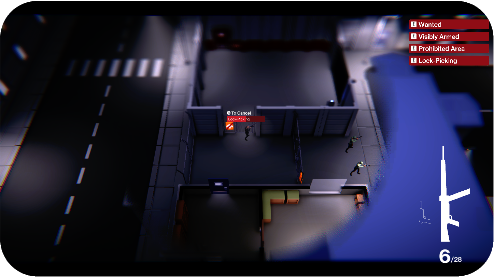
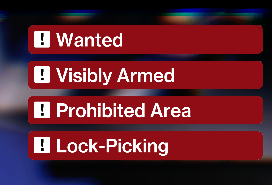
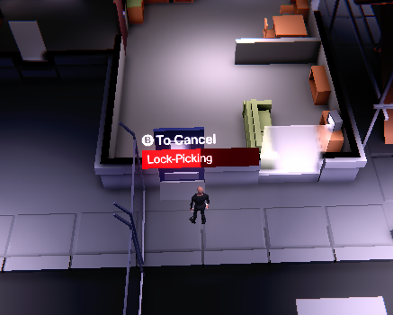

# Devlog Capitolo 5(Diario di sviluppo issue 10)

- Label stato di gioco possibili situazioni pericolo.
- Timed task giocatore

&nbsp;

&nbsp;

# Label possibili stati di allerta

Delle label si attivano con una animazione in alto a destra quando il giocatore commette delle azioni che scatenerebbero degli stati dall'allerta se le guardie nemiche percepissero l'azione.
Le label appaiono singolarmente in base all'azione illegale commessa.

&nbsp;

# Timed Interaction

Alcune interaction degli interactable object per questione di design possono richiedere più di un istante prima di poter essere completate. Per necessità di simulare l'attesa di una interaction, sono stati implementati i "Timed task" che rappresentano appunto le interaction che richiedono del tempo affinchè vengano eseguiti. L'esecuzione di queste interaction però sempre per motivi di game design renderanno impossibile i movimenti del character player fin quando la timed interaction non è completa. La timed interaction però sempre per motivi di game design può essere interrotta dallo stesso giocatore, questo però comporterà il non completamento della stessa.

## Appena più concettualmente
Concettualmente un interactable object offre una interazione, esso può richiamare il **timed interaction** del character che sta effettuando l'interazione. Come visto nel capitolo 1 degli interactable objects, gli interactable objects sono in grado di offrire delle interazioni(eventi) che però per essere eseguiti richiedono il Character Manager di chi li esegue, questo consentirà di influenzare il character che sta effettuando l'interaction in questo caso avviando la Timed interaction. Durante l'esecuzione della timed interaction non sarà possibile eseguire movimenti del character, ma sarà sufficiente premere un tasto per annullarla uscendo dallo stato di "_isTimedInteractionProcessing" (stato del character)

## Slider UI per rappresentare le Timed Interaction
Costruita UI ed implementato manager UI delle timed interaction. Tramite il loop delle timed interaction è possibile inizializzare (min value, max value) uno slider e aggiornare in tempo reale sulla UI lo stato di avanzamento della timed interaction. Dalla barra è visualizzabile il nome della timed interaction. Nella label superiore viene visualizzato il comando per annullare la timed interaction.

## Applicazione timed Interaction nello scassinamento delle porte
Le timed interaction sono state usate nelle interazioni dello scassinamento delle porte. Per design scassinare la porta rende il character vulnerabile ma libero di annullare e ricominciare in seguito l'interaction

# Vari fix
- Vari fix per equilibrare il gioco(velocità reazione Characters e FOV Characters)
- Scassinare una porta espone il character a possibili stati di allerta, questo è visualizzabile dalla label che appare in alto a destra.
