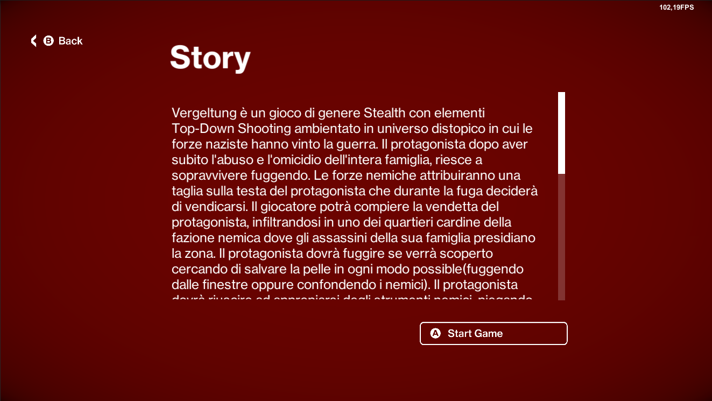

# Devlog Capitolo 6(Diario di sviluppo issue 26)

- Mega capitolo Behaviour IA dei characters

&nbsp;

&nbsp;

# Stati dell'IA e implementazione Behaviour degli stati

- Nuovi stati di allerta
- Implementazione dei behaviour dei rispettivi stati del character
- Vari miglioramenti + implementazioni minori

## Passaggio tra behaviour
Il modo con cui vengono gestiti gli stati del'IA può essere rappresentato con una struttra simile agli automi a stati finiti ma senza uno stato finale. In cui le transizioni sono le chiamate a dei metodi di check che verificano se si può entrare in uno stato o meno.
(ultima posizione in cui è stato rilevato il character)

## L'idea della progettazione
L'idea è stata quella di sviluppare i vari subBehaviour come se fossero dei processi di un sistema operativo che **NPCBehaviourManager** può gestire(Come se fossero dei thread, l'API Unity non è thread-safe). Ogni processo specializza la classe **BehaviourProcess**, reimplementandone il metodo **runBehaviourAsyncProcess**, in modo che l'**NPCBehaviourManager** tratterà le istanze delle classi derivate da **BehaviourProcess** come un'istanza della classe **BehaviourProcess**, questi processi hanno uno stato di inizio e uno stato di fine. In questo modo è stato possibile concatenare in modo articolato i vari subBehaviour. Ad esempio una volta concluso il behaviour process dello stato di sospetto, viene fatto partire il behaviour process della ricerca del character.

> Sia il **character NPC A** istanza di una entità character tale che non sia player

L'istanza del componente **BaseNPCBehaviourManager** del character contiene l'implementazione dei metodi di check, i metodi check alarm per essere chiamati prevedono il passaggio di una posizione o di un character che potenzialmente può innescare uno stato di allarme. Se questa verifica da un esito positivo allora si può settare un certo stato di allarme che provocherà l'esecuzione di un certo behaviour o meno. Questi metodi di check possono essere reimplementati nelle classi figlie(CivilianNPCBheaviour, EnemyNPCBehaviour), per fare dei controlli più specifici o per avere implementazioni più specifiche rispetto al ruolo del character(civile o nemico)
> Esempi di metodi check alarm
> - suspiciousCheck
> - hostilityCheck
> - receiveWarnOfSouspiciousCheck
> - suspiciousCorpseFoundCheck
> - corpseFoundConfirmedCheck
> - suspiciousHitReceivedCheck

Questi metodi di check sono chiamati dall'istanza del componente FOV del character che rappresenta i "sensori dell'IA".

## lastSeenFocusAlarmPosition

La **lastSeenFocusAlarmPosition** è una variabile Vector3(vettore posizione) delle istanze dei **BehaviourProcess** e rappresenta l'ultima posizione in cui qualcosa ha innescato un certo stato del character. Questa posizione verrà aggiornata e usata durante l'esecuzione dei **BehaviourProcess**

> ### Esempio 1:
> Nel check degli stati **suspiciousCheck e hostilityCheck** la **lastSeenFocusAlarmPosition** rappresenta l'ultima posizione in cui il character è stato rilevato.s
> ### Esempio 2:
> Nel check dello stato **receiveWarnOfSouspiciousCheck** la **lastSeenFocusAlarmPosition** rappresenta la posizione in c'è stata un'attività sospetta e che deve essere raggiunta da una guardia nemica.

Questa posizione viene anche usata dai behaviour degli stati di allarme Suspicious e Hostility alert del character quando il character che ha provocato l'allarme è fuori dal campo visivo. Quindi il character proverà a raggiungere la **lastSeenFocusAlarmPosition**, ovvero l'ultima posizione in cui è stato avvistato un character ostile.

&nbsp;

# Implementazioni Behaviour stati
I behaviour possono implementare una specializzazione nelle classi figle (EnemyNPCBehaviour, CivilianNPCBehaviour), infatti alcuni behaviour saranno differenti in base al ruolo del character.

## SuspiciousAlert state e suspiciousAlertBehaviour 
Implementato il **suspiciousAlertBehaviour** nelle specializzazioni CivilianNPCBehaviour e EnemyNPCBehaviour behaviour dello stato del character SuspiciousAlert

I Civili e i Nemici entrano nello stato di SuspiciousAlert in base al risultato dei check spiegati nel [capitolo 4](https://github.com/RayCatcherS/Vergeltung/blob/main/DevDiary/(4)diary_issue%2310/README.md).
> Durante lo stato di **SuspiciousAlert**, viene eseguito in loop il behaviour corrispondente **suspiciousAlertBehaviour**.
> Durante il **suspiciousAlertBehaviour** il character cercherà di avvicinarsi al character che ha rilevato come sospetto. Se il character che ha provocato l'allarme va fuori dalla portata del FOV del
> character, allora il character cercherà di raggiungere la **lastSeenFocusAlarmPosition** (l'ultima posizione in cui è stato visto il character), altrimenti se il character che ha provocato
> l'allarme è alla portata del fov del character cercherà di raggiungere la posizione del character, ruotando in direzione del character che ha scatenato l'allarme.
> Quando il character che ha scatenato l'allarme è fuori portata il character resterà fermo nell'ultima posizione in cui è stato avvistato il character che ha scatenato l'allarme.
> Durante questo stato il campo visivo è maggiore.

&nbsp;

## HostilityAlert state e hostilityAlertBehaviour 
Implementato il **suspiciousAlertBehaviour** nelle specializzazioni CivilianNPCBehaviour e EnemyNPCBehaviour behaviour dello stato del character HostilityAlert

### Implementazione EnemyNPCBehaviourManager:
> Durante lo stato di **HostilityAlert**, viene eseguito in loop il behaviour corrispondente **hostilityAlertBehaviour**.
> Durante l'**hostilityAlertBehaviour** il character nemico cercherà di avvicinarsi al character che ha rilevato come ostile. Se il character che ha provocato l'allarme va fuori dalla portata del FOV del
> character, allora il character cercherà di raggiungere la **lastSeenFocusAlarmPosition** (l'ultima posizione in cui è stato visto il character), altrimenti se il character che ha provocato
> l'allarme è alla portata del fov del character cercherà di raggiungere la posizione del character, ruotando(non istantaneamente ma usando una funzione di interpolazione) nella direzione del character che ha scatenato l'allarme.
> Inoltre il character aprirà il fuoco in base all'arma selezionata
> Quando il character che ha scatenato l'allarme è fuori portata il character resterà fermo nell'ultima posizione in cui è stato avvistato il character che ha scatenato l'allarme.
> Durante questo stato il campo visivo è maggiore.

&nbsp;

### Implementazione CivilianNPCBehaviourManager:
> Durante lo stato di **HostilityAlert**, viene eseguito in loop il behaviour corrispondente **hostilityAlertBehaviour**.
> Durante l'**hostilityAlertBehaviour** il character civile chiederà al controller **SceneEntitiesController** tramite un metodo di restituire la prima guardia nemica più vicina che non è impegnata in
> alcuno stato di allerta(Ovvero le guardie nemiche che sono nello stato di **Unaler** state). Il character civile raggiungerà la guardia nemica correndo e la notificherà passando il
> **lastSeenFocusAlarmPosition** e avviando il **receiveWarnOfSouspiciousCheck**. Il behaviour non terminerà fino a quando il civile non avrà raggiunto la guardia da notificare. Il character civile potrà notificare una sola guardia alla volta.
> I civili non chiameranno la guardia più vicina se riceveranno lo stato di **hostilityAlertBehaviour** in modo indotto, quindi in caso lo stato sia stato indotto i civili resteranno fermi. I civili chiameranno la
> guardia più vicina solo se hanno attivato lo stato **HostilityAlert** tramite il loro stesso FOV. Gli stati indotti vengono spiegati nel [capitolo 4](https://github.com/RayCatcherS/Vergeltung/blob/main/DevDiary/(4)diary_issue%2310/README.md#comunicazione-istantanea-stati-di-allerta-npc-vicini)
> Durante questo stato il campo visivo è maggiore.

&nbsp;

## SuspiciousCorpseFoundAlert state e suspiciousCorpseFoundAlertBehaviour
Questo è un nuovo stato di allerta e ha meno priorità degli stati **HostilityAlert** e **SuspiciousAlert**, vuol dire che questo stato viene terminato dando priorità a stati come
**HostilityAlert** e **SuspiciousAlert**.
> Questo behaviour rappresenta il sospetto di aver trovato un cadavere.
> Durante lo stato di **SuspiciousCorpseFoundAlert**, viene eseguito in loop il behaviour corrispondente **suspiciousCorpseFoundAlertBehaviour**.
> Durante l'**suspiciousCorpseFoundAlertBehaviour** i character civili e nemici cercheranno di raggiungere il cadavere correndo utilizzando la **lastSeenFocusAlarmPosition** che corrisponderà alla posizione in cui è
> stato trovato morto il character.

&nbsp;

## CorpseFoundConfirmedAlert state e corpseFoundConfirmedAlertBehaviour
Questo è un nuovo stato di allerta e ha meno priorità degli stati **HostilityAlert** e **SuspiciousAlert**, vuol dire che questo stato viene terminato dando priorità nel caso si attivino gli stati
**HostilityAlert** e **SuspiciousAlert**.

### Implementazione EnemyNPCBehaviour:
> Questo behaviour rappresenta lo stato di allarme dell'aver confermato la presenza di un cadavere.
> Durante lo stato di **CorpseFoundConfirmedAlert** del character nemico si avvicinerà al cadavere per qualche secondo per poi tornare allo stato di Unalert.
> Durante questo stato il campo visivo è maggiore.

### Implementazione CivilianNPCBehaviour:
Questo behaviour rappresenta lo stato di allarme dell'aver confermato la presenza di un cadavere.
> Durante lo stato di **CorpseFoundConfirmedAlert** il character civile chiederà al controller **SceneEntitiesController** tramite un metodo di restituire la prima guardia nemica più vicina che non è impegnata in
> alcuno stato di allerta(Ovvero le guardie nemiche che sono nello stato di **Unaler** state). Il character civile raggiungerà la guardia nemica correndo e la notificherà passando il
> **lastSeenFocusAlarmPosition** e avviando il **receiveWarnOfSouspiciousCheck**. Il behaviour non terminerà fino a quando il civile non avrà raggiunto la guardia da notificare. Il character civile potrà notificare
> una sola guardia alla volta.

&nbsp;

## WarnOfSuspiciousAlert state e warnOfSouspiciousAlertBehaviour
Questo è un nuovo stato di allerta e ha meno priorità degli stati **HostilityAlert** e **SuspiciousAlert**, vuol dire che questo stato viene terminato dando priorità a stati come
**HostilityAlert** e **SuspiciousAlert**.

> Questo behaviour viene attivato quando il character nemico riceve un warn da un civile il cui behaviour è quello dell'**HostilityAlert** o dell'aver confermato la presenza di
> un cadavere (**CorpseFoundConfirmedAlert**). Nello stato di **WarnOfSuspiciousAlert** il nemico ricevere una posizione dal civile (**lastSeenFocusAlarmPosition**), questa
> posizione verrà raggiunta di corsa dal character nemico, simulando uno stato di indagine. Alla scadenza del timer del behaviour il character nemico tornerà nello stato di
> unalert.
> Per adesso questo behaviour è implementato solo dalle guardie.

&nbsp;

## instantOnCurrentPositionWarnOfSouspiciousAlert state e instantOnCurrentPositionWarnOfSouspiciousAlertBehaviour
> Questo behaviour viene attivato quando una **LoudArea** genera un suono di intensità bassa e il suo stato è di **Unalert**. Nello stato di **instantOnCurrentPositionWarnOfSouspiciousAlert** verrà simulato uno stato di indagine. Alla scadenza del timer del behaviour il character nemico tornerà nello stato di unalert.

 

## playerLoudRunAlert state e playerLoudRunSuspiciousAlertBehaviour
> Questo behaviour viene attivato quando il player correndo passa vicino ai characters e i characters sono nello stato di Unalert. Questo si insospettirà e restando fermo ruoterà verso il player. Questo permette di avvicinarsi ai characters solo se non si sta correndo ovvero in modo stealth. Quando il player corre emetterà delle Loud Area che faranno scaturire lo stato **playerLoudRunAlert** ai character vicini. Se il character allarmato perde di vista il character fisserà la **lastSeenFocusAlarmPosition**. Questo behaviour verrà attivato solo se non c'è un collider tra il character e la loudArea.

 

&nbsp;

# LoudArea
Le **LoudArea** sono state create con l'intento di simulare un allarme provocato da un forte suono. Ad esempio l'utilizzo di un'arma non silenziata.
Le loud area sono istanze di oggetti della classe **LoudArea**. Permettono di simulare la propagazione di un allarme sui character scaturita da oggetti che provocano dei suoni, ad esempio uno sparo allarmerà i nemici, facendo raggiungere loro una zona vicina alla Loud Area. Oppure alcuni suoni bassi potrebbero far andare le guardie in uno stato di allerta di ricerca e sospetto.
La LoudArea genererà anche un suono che verrà passato al costruttore durante l'inizializzazione

L'intensità dei suoni può essere:
- nessuna (Viene generato un suono ma non vi è nessuna propagazione di allarme)
- bassa (Viene propagato lo stato **instantOnCurrentPositionWarnOfSouspicious**, piccola area di propagazione. Esempio armi silenziate o proiettili che si infrangono sulle superfici )
- media (Viene propagato lo stato **WarnOfSuspiciousAlert**, ampia area di propagazione. Esempio: armi non silenziate ) 

## Implementazione propagazione allarme character sull'intensità bassa
Vengono allertati tutti i character(nemici e civili) che sono all'interno della **LoudArea** avviando il **instantOnCurrentPositionWarnOfSouspiciousCheck** cambiando il loro stato di allerta e avviando il Behaviour process **warnOfSuspiciousAlertBehaviour**.

## Implementazione propagazione allarme character sull'intensità media
Partendo da tutti i character che sono all'interno della **LoudArea** vengono presi i primi due character più vicini all'interno di quest'area e che non sono in alcuno stato di allarme. Vengono calcolate delle posizioni raggiungibili dal sistema di navigazione(agent) sulla navmesh(o comunque generare questi punti fino a quando non sono raggiungibili), le posizione saranno abbastanza vicine all'origine dalla LoudArea, questo simulerà il fatto che le guardie non raggiungeranno con precisione il punto in cui c'è stato il forte rumore che le ha allarmate.
Dopo aver calcolato questi punti la **LoudArea** richiamerà la funzione **warnOfSouspiciousCheck** delle due guardie chiamate cambiando il loro stato di allerta e avviando il Behaviour process **warnOfSuspiciousAlertBehaviour**.

### Esempio LoudArea(media intensità) generata dagli spari di un'arma non silenziata

### Esempio LoudArea(bassa intensità) generata dagli impatti dei proiettili

La configurazione di questa LoudArea(bassa intensità) farà avviare al character l'**instantOnCurrentPositionWarnOfSouspiciousCheck** di cui la prima posizione raggiunta dal character sarà proprio la zona dove si è generata la LoudArea. Questo permetterà di eseguire la combo illustrata nella gif sotto.

&nbsp;

# Miglioramenti IA
## Simulazione ricerca del player
Tramite un semplice algoritmo vengono generate *n* posizioni casuali entro un certo raggio *r* il cui centro è la posizione del character, ottenute queste posizioni, queste vengono convertite in posizioni raggiungibili dall'agent del character, ottenendo le posizioni più vicine rispetto al sistema di navigazione navmesh(raggiungibili quindi dagli agent). Le posizioni che non sono raggiungibili dall'agent vengono scartate e rigenerate fino a quando non si raggiunge la quantità *n* di posizioni raggiungibili dall'agent.
I character che sono negli stati di allarme dopo aver raggiunto la **lastSeenFocusAlarmPosition** simuleranno la ricerca del player che ha innescato lo stato di allerta raggiungendo tutte le posizioni generate, in modo da aumentare le probabilità che il player venga trovato.
I pallini viola illustrati rappresentano le posizioni generate che i character in allerta generano e che devono raggiungere, simulando la ricerca del character.

### Esempio 1:

### Esempio 2:

## Cadenza di tiro variabile
I nemici quando apriranno il fuoco nei confronti di un character ostile lo faranno in modo non continuo. Ci saranno degli intervalli di tempo in cui non verrà aperto il fuoco, seguiti da intervalli di tempo in cui verrà aperto il fuoco, alternando queste due fasi. Questo consente di equilibrare la difficoltà di gioco, il giocatore non sarà costantemente sotto il fuoco nemico.

## Gli NPC ruotano verso il player quando vicini
Il character player verrà fissato dagli altri character che non sono in uno stato di allarme se il character passerà vicino al loro campo visivo ravvicinato.

## NPC più acuti durante gli stati di allerta
Gli NPC aumentano il loro secondo campo visivo più esterno(colore giallo) quando sono in questi stati d'allerta e lo stato di NightMalus non è attivo
- SuspiciousAlert,
- HostilityAlert,
- WarnOfSuspiciousAlert,
- SuspiciousCorpseFoundAlert,
- CorpseFoundConfirmedAlert,
- SuspiciousHitReceivedAlert
- MediumLoudSoundAlert

## Correre vicino agli NPC durante gli stati di allerta
Se il player correrà vicino agli NPC che sono in stato di allerta farà settare la loro **lastSeenFocusAlarmPosition** del **processBehaviour** in esecuzione in direzione della **LoudArea** generata dal player in corsa, questo farà raggiungere immediatamente la loudArea generata dal player.

&nbsp;

# Varie implementazioni migliorate:
- Le porte aperte dagli NPC vengono aperte solo quando gli agent sono in movimento, puntano nella direzione della porta e questa distanza tra NPC e la porta è minore di un certo valore. Le porte aperte dagli NPC non si aprono più quando non serve.

- Tutti gli oggetti che offrono delle interazioni(interactableObjects) sono indicati con questo shader programmato tramite lo strumento **Shader Graph** di Unity. In questo modo sarà più intuitivo capire con quali oggetti è possibile interagire(Compresi i cadaveri dei characters morti).

|  |  |

- Alcune porte si potranno aprire solo se si possiede una certa chiave
- Le porte chiuse a chiave possono essere aperte senza scassinarle da un certo lato(configurabile)
- Gli agenti possono avere 3 opzioni per il movimento camminata lenta, camminata normale, corsa(sono anche configurate le rispettive animazioni)
- Gli NPC quando eseguono un task ruotano la loro direzione in direzione del task(rotazione interpolata non diretta)
- I vetri delle abitazioni possono essere rotti con i proiettili, questo permetterà al giocatore di fuggire dalle finestre nel caso in cui si dovesse improvvisare una fuga.

- Migliorata la propagazione istantanea di uno stato di allerta ai character vicini. La propagazione avviene solo se un raggio partendo dal character *A* riesce ad arrivare al character *B*. In altre parole se il linecast arriva fino a *B* e non vengono rilevati ostacoli tra *A* e *B*, allora verrà comunicato lo stato di allerta. Previene le situazioni in cui viene propagato lo stato di allerta anche a NPC che sono fuori dall'edificio e che non potrebbero avere appunto delle comunicazioni. Come si può vedere dall'animazione il segnale dall'arme non viene propagato oltre gli ostacoli.

- Vari miglioramenti sulla NavMesh e sulla navigazione degli agent sulla mappa.
- Non è più possibile sparare quando il character è **isBusy** quindi anche durante una timed interaction.

&nbsp;

# Schermate UI:
Implementati menu + navigazione fra menu.
## Menu principale, Impostazioni e storia
Nel menù principale si potranno settare le impostazioni grafiche(risoluzione schermo). Puoi scrollare la storia prima di iniziare a giocare.

## Schermata di game over
Implementato lo stato di game over, il passaggio alla schermata game over e la possibilità di stoppare i behaviour di tutti i characters in esecuzione.
Dalla schermata di game over puoi ricominciare il gioco oppure tornare al menu principale.

