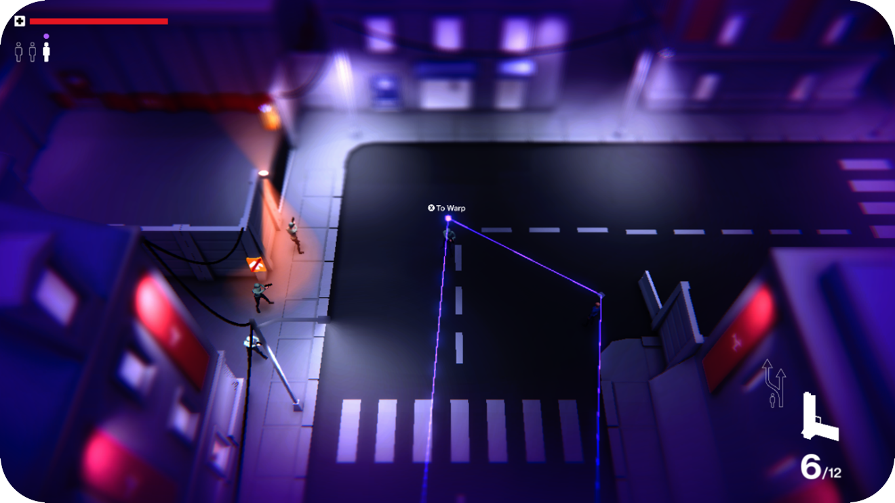
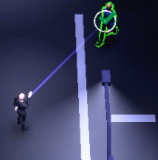
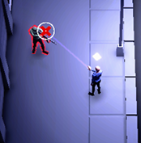
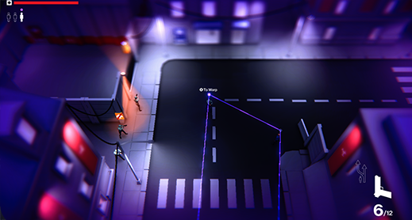
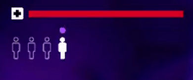
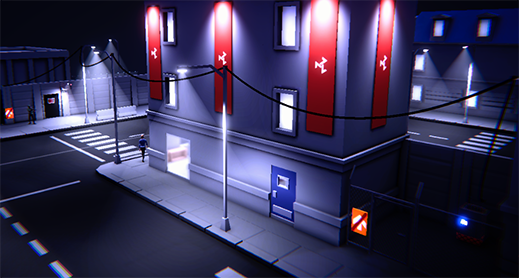
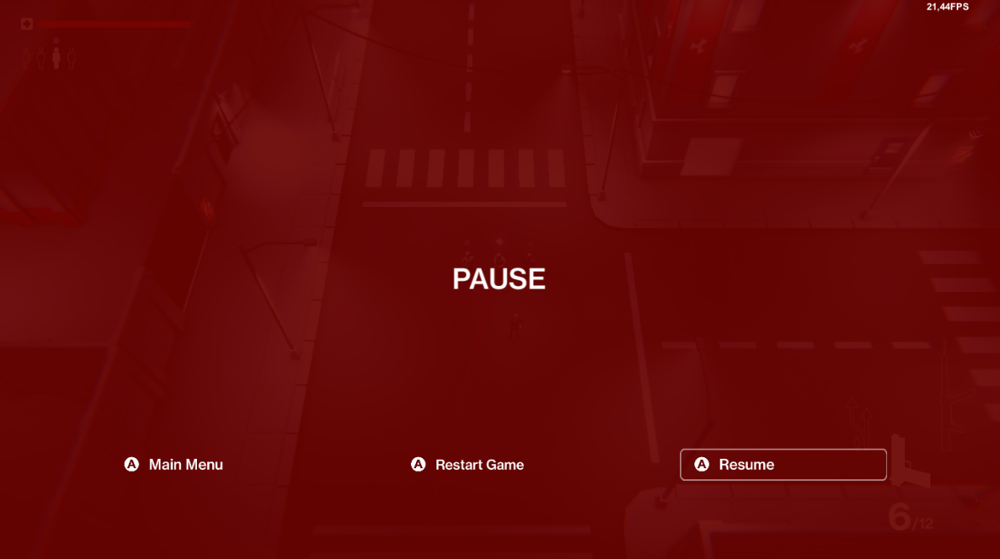

# Devlog Capitolo 7(Diario di sviluppo issues 49-28-42-43)

- Sviluppo Meccanica di gioco controllo dei characters e switch tra i vari characters controllati

&nbsp;

&nbsp;

# Meccanica controllo characters
Viene usata la classe WeaponItem per implementare l'oggetto spara raggi per controllare i characters.
Tutti possiedono questa arma(controllo), può usarla solo il giocatore.
I characters controllati vengono riconfigurati disattivando il baseBehaviour e stoppando il processo dell'IA(Capitolo IA). Vengono scollegate le references del vecchio character dalle UI che rappresentano lo stato del character, e vengono collegate le nuove references al nuovo character che si vuole controllato.

## Raggio controllo characters
Descrizione meccanica:
Per controllare gli altri character bisogna recuperare le munizioni speciali

## Munizioni controllo
Le munizioni per il controllo sono globali non appartengono al personaggio controllato
- 1 munizione per controllare i civili
- 3 per i soldati
Il colpo parte e torna indietro se non va a segno su un character o se il character non può essere controllato.
Le munizioni dei colpi vengono rimosse solo se il colpo va correttamente a segno ed il character può essere controllato.
Non si possono controllare i target.
Non si possono controllare i characters già sotto controllo.

## Puntatore controllo
Il puntatore UI dell'arma visualizza l'icona "V" se si può controllare un certo character, altrimenti una "X" che indica che è impossibile controllare un certo character.
| Controllo permesso: | Controllo non permesso: |
| ------------- |:-------------:|
|  |  |

## UI catena characters
Tramite UI è possibile visualizzare il numero di character controllati ed in particolare quale si sta controllando.
Quando un character centrale muore viene aggiornata l'UI e tutti i character che vengono dopo muoiono.

## Modalità navigazione
Modalità navigazione
Modalità navigazione characters controllati. Nella modalità navigazione il tempo scorre lentamente dando la possibilità di selezionare il character da switchare. Delle line renderer sottili vengono disegnate di character in character(servono a visualizzare chi sono i character controllati e dove si trovano)

# UX character controllati
I characters controllati hanno un simbolo semi trasparente di colore viola sulla loro testa.
I character controllati vengono visualizzati con un rombo di colore grigio se non sono attualmente controllati in quel momento.
I character controllati in un determinato momento vengono visualizzati con un rombo di colore viola monolite.
Questa animazione sparisce se il character muore.
Il character protagonista non ha alcuna icona di colore viola in quanto non è un character controllato.

## UI character controllati
Tramite UI è possibile visualizzare qual è il character attualmente controllato e quanti sono in tutto i character controllati.

# Ottenimento energia controllo
Per ottenere l'energia per il controllo dei characters bisognerà sabotare/disattivare i macchinary usati per estrarre energia dai monolity. I macchinari disattivati rilasceranno l'energia per il controllo.

## Macchinari da sabotare
Per sabotare i macchinari bisognerà attivare ripetutamente la console collegata all'impianto estrazione dell'energia fino a quando la barra di sovraccarico non raggiunge il valore massimo. La barra dello slider si abbasserà man mano che passa il tempo.

&nbsp;

# Vari miglioramenti e implementazioni
- Implementato puntatore UI che indica la destinazione dei colpi sparati
- Ora è possibile visualizzare la barra della vita di ogni character controllato
- Viene avviato un effetto Post Processing quando il character usato subisce del danno
- I tasti per riporre ed estrarre l'arma ora sono separati(evita che ci si confonda)
- Camminare in direzione di un character vicino lo sposterà, questo evita che un character possa interrompere il movimento del giocatore.
- Aggiunta pistola senza silenziatore(versione loud area)
- Le armi possono condividere tipi di munizioni(pistola e pistola silenziata)
- I generatori della corrente vengono riattivati tutti una volta che la corrente elettrica torna
- Le porta nera potranno essere aperte interamente solo dai soldati nemici
- Aggiunti dei cavi elettrici che indicano dove si trovano i generatori elettrici

- Risolti vari bugs
- Le aree vietate ai civili sono indicate dal cartello accesso vietato
- Implementato menu pausa e tasto per uscire dal gioco. Gli stati di gioco sono gestiti dal controller GameState. Quando si è in pausa il Time del gioco viene settato a 0. Essendo tutte le meccaniche basate sullo scorrimento del tempo, tutto verrà stoppato.

## Effetti audio
- Implementato suoni dei passi dei characters, corsa e cammino. I characters controllati dal giocatore principale emetteranno dei suoni con i passi del character solo se questi correranno
- Suoni sabotaggio generatori corrente elettrica(in-out)
- Suono apertura chiusura porte(Trigger timeline animazioni)
- Effetto audio alla raccolta di items
- Suoni interazioni con le console
- Suono apertura e chiusura dei cancelli(Trigger timeline animazioni)
- Suono al cambio di un character tramite il warp

