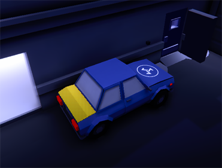

# Devlog Capitolo 8(Diario di sviluppo issues 47-29-31)

- Sviluppo del sistema obiettivi di gioco

&nbsp;

&nbsp;

# Sistema gestione degli obiettivi di gioco
Per gestire gli obiettivi della partita è stata implementata la classe **"GameModeController"**. Questa classe incapsula le istanze(lista) di **"GameGoals"** classe che rappresenta un obiettivo di gioco. 
La classe **"GameGoals"** contiene: id dell'obiettivo(nome), quantità di sotto-obiettivi da portare a termine e quantità di obiettivi portati a termine.
La classe **"GameModeController"** espone un metodo(pubblico) per aggiornare lo stato di un obiettivo di gioco a cui bisognerà passare l'id dell'obiettivo di gioco e il tipo di modifica che si vuole effettuare(enum). Per qualsiasi oggetto che è in relazione con il **"GameModeController"** può aggiornare lo stato degli obiettivi.

## UI degli obiettivi
L'UI degli obiettivi è visualizzabile in alto a sinistra. La lista è visualizzabile la lista di istanze di Goal in ordine.
Per ogni goal si può selezionare una lista di icone(sprite images) configurando l'istanza di **"GameGoals"**.
Quando un goal è completo l'icona diventa un simbolo di visto.
Quando un goal è completo, viene barrato.

## UI degli obiettivi in game
Per indicare esplicitamente gli oggetti che cambiano lo stato degli obiettivi sono stati implementati degli indicatori che segnalano l'obiettivo. Questi indicatori ruotano in direzione della camera principale e sono sul layer UI, in modo che vengano visualizzati dalla camera addetta alla visualizzazione della world UI. In questo modo la world UI starà sempre al di sopra di qualsiasi oggetto di gioco

&nbsp;

# GameSoundtrackController per mixare la musica di gioco in base al contesto
Implementato un controller sullo stato di gioco, che stabilisce lo stato globale del giocatore(stato sospetto, ostilità, stato di non allerta). Questo controller permette di riprodurre vari pezzi della theme music in base alla situazione di gioco(suspicious, hostility, unalert). Questo aiuta a far percepire al giocatore lo stato di pericolo in cui si trova.
## Tecnicamente
Ogni volta che un character entra in uno dei 3 stati di allerta principali (suspicious, hostility, unalert) viene aggiunto il character all'interno di un dizionario {statoAllerta(enum), instanceID(CharacterManager)}.
Dopodiché il controller avvierà un controllo su quale stato dell'animator avviare.

### Il controller in base agli stati di allerta presenti nel dizionario agirà nei seguenti modi:

- Se nel dizionario esistono solo character civili in stato di suspicious oppure hostility e nessun character nemico(in suspicious o hostility), il trigger dell'animator verrà settato su suspicious
- Se nel dizionario esiste anche solo un character guardia nemica in stato suspicious e non ci sono altri character nemici in stato di hostility, il trigger dell'animator verrà settato su suspicious
- Se nel dizionario esiste anche solo un character guardia nemica in stato di hostility, il trigger dell'animator verrà settato su hostility
- Se nel dizionario non è presente nessun elemento l'animator verrà settato su unalert

&nbsp;

# Vulnerabilità colpi alle spalle(esecuzione), ancora altra trigonometria
L'area all'interno delle due rette rosse rappresenta l'angolo entro cui il character che vuole effettuare **l'esecuzione** deve essere. Inoltre la direzione dell'arma rispetto al character su cui si vuole effettuare **l'esecuzione** deve formare un angolo compreso tra le due rette rosse. Se queste due condizioni sono rispettate, il mirino dell'arma cambierà la sua icona in un teschio. Se il player sparerà un colpo di arma da fuoco verrà generato un proiettile letale che ucciderà istantaneamente il character su cui si vuole effettuare **l'esecuzione**.

&nbsp;

# Mappa di gioco
Nella schermata di pausa è possibile visualizzare la posizione dei characters e tutti gli obiettivi di gioco, dando ulteriori indicazioni sulla posizione degli obiettivi di gioco. 
### Tecnicamente
Una camera ulteriore è stata aggiunta con prospettiva dall'alto verso il basso. Questa camera è in grado di vedere solo i gameobject sul layer "Map". Ogni elemento di gioco è quindi segnalabile sulla mappa con un nuovo componente che ho creato, chiamato **IconMapManager** in cui ne si può gestire la visibilità sulla mappa e l'icona selezionabile. Questa camera renderizza tutto su una renderer texture che a sua volta è assegnata ad un elemento dell'UI della pausa che visualizzerà il tutto creando un effetto sovrapposizione.

&nbsp;

# Level design
- Aggiunte auto equipaggiamento speciale(pistola silenzata). Scassinando il baule sarà possibile ottenere una pistola silenziata ma senza colpi.

- Le casse di munizioni per pistola silenziata/pistola si trovano nelle basi militari (casse) oppure sparse per la mappa

# Vari miglioramenti e implementazioni
- Sabotare più volte un generatore condurrà al generatore una guardia in più nello stato di warn (questo impedisce che il giocatore possa usare il generatore per eliminare una ad una le guardie che vengono allertate)
- Aggiunta world UI tutorial sezione iniziale per spiegare le meccaniche principali
- Schermata di vincita(fine partita) + crediti
- L'energia per il controllo(munizione per la control gun) è segnalata da una icona(world UI)
- Aggiunta forza impatto bullet alla morte del character aggiungendo una forza sulla ragdoll
- Navigando tra i character controllati durante la Warp Mode è possibile avere un'anteprima sui possibili stati di allerta del character
- fix suoni raccolta items

