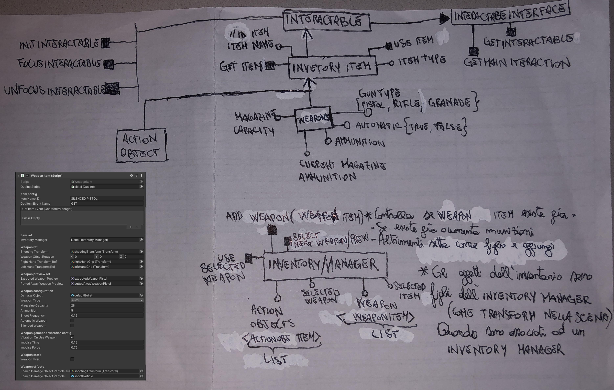
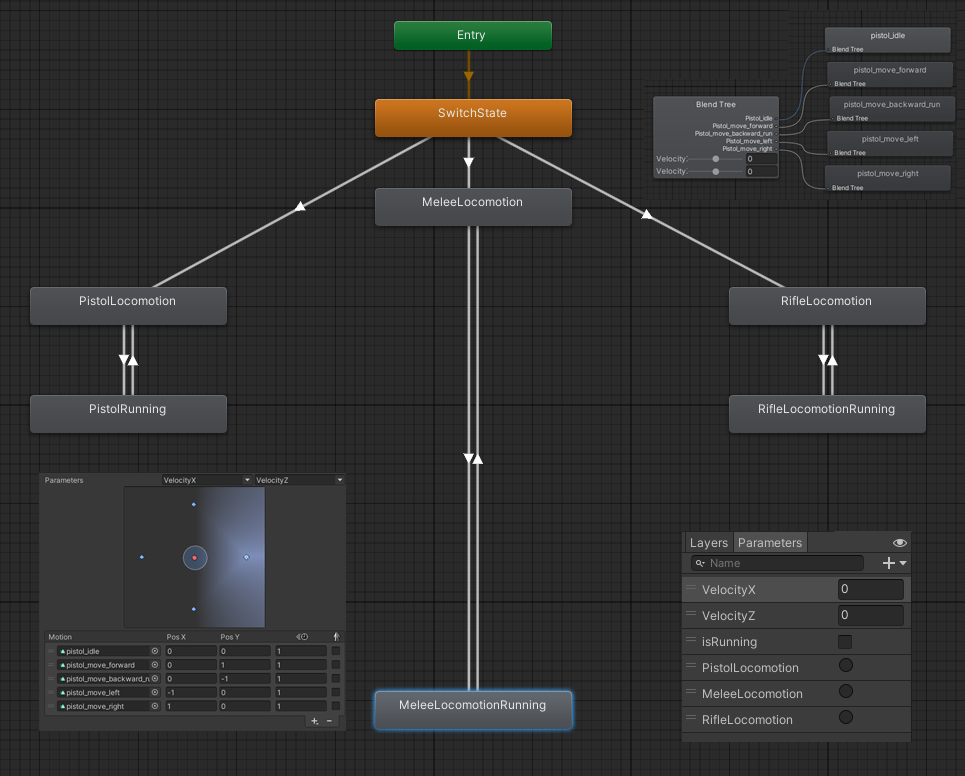
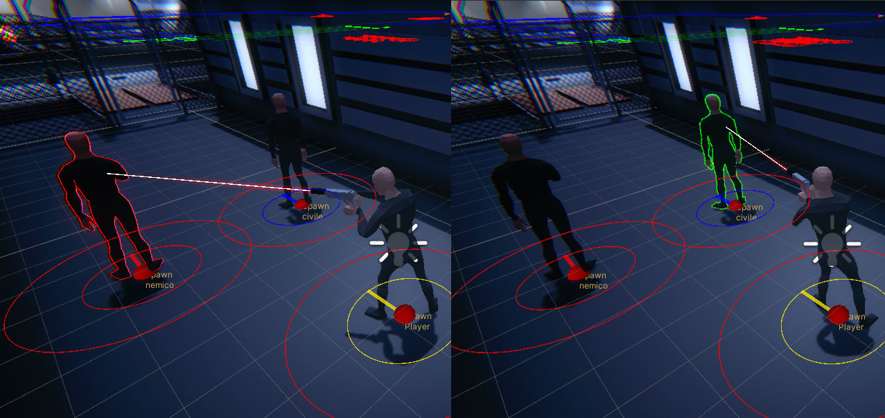
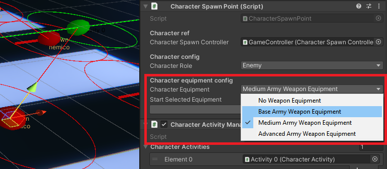
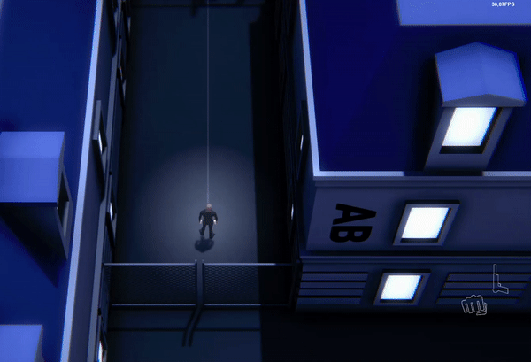

# Diary di sviluppo issue 6-8-18-17

## Progettazione concettuale classi
- Generalizzazione classe InventoryItem e classi figlie (WeaponItem, ActionObjectItem)
- Classe InventoryManager, componente dei character, implementata per gestire l'inventario del character

&nbsp;

### Specializzazioni Weapons
implementate tipologie di armi. Servono ad azionare animazioni o comportamenti del character differenti in base al tipo di arma usata
<pre><code>public enum WeaponType{
    melee,
    pistol,
    rifle,
    granade
}</code></pre>

&nbsp;

&nbsp;

---

&nbsp;

&nbsp;

## Animazioni e rigging
### Stati animator + blendTree stati
> Progettato animator a stati, serve a switchare l'animazione del character in base al tipo di arma impugnata. Gli stati vengono gestiti dall'InventoryManager del character

&nbsp;

### Rigging character
Usato sistema di rigging di Unity. Permette di configurare le articolazioni di uno scheletro mentre è in corso una certa animazione sullo scheletro.
Questa funzionalità consente di ancorare le articolazioni del character ad un certo target(la weapon), nosostante l'animazione sullo scheletro.

| Esempio senza Rig: | Esempio con Rig: |
| ------------- |:-------------:|
|  |  |

| Esempio 2 senza Rig: | Esempio 2 con Rig: |
| ------------- |:-------------:|
|  |  |

&nbsp;

&nbsp;

---

&nbsp;

&nbsp;

## Implementazione sistema shooting dei characters e inventario

### Outline character mirati
Quando il character player(controllato dall'utente) mira un character viene visualizzato un outline sulla sua mesh. Consente di distinguere le varie categorie dei character(civili, nemici)

&nbsp;

### Shooting weapons, fisica proiettile, effetti particellari (trigonometria a gogo)
- Le armi hanno un rateo che rappresenta la frequenza di colpi sparati
- Le armi possono essere automatiche o semiautomatiche (gestione input)
- Implementato classe GamepadController per gestire le vibrazioni del Pad di gioco
- Implementato precalcolo e anteprima della direzione del colpo che verrà sparato
- Le armi vengono configurate tramite editor "WeaponItem", impostando punto da cui viene generato il colpo, punto da cui viene generato l'effetto particle e punti di ancoraggio sull'arma per il rigging delle articolazioni
- Implementato shooting delle armi
- Le armi possono essere silenziate (solo valore bool)
- Il proiettile ha componente con parametri sul danno, velocità e direzione. Il proiettile si muove tramite la fisica dell'engine in FixedUpdate verso la direzione configurata(direzione shooting arma).
- Essendo il calcolo degli eventi basati sulla fisica, se il proiettile è troppo rapido non rileva la maggior parte delle collisioni (effetto teletrasporto oltre i collider), per evitare problemi di collisioni basati sulla bassa frequenza di aggiornamento della fisica, è stato implementato un metodo per cui il proiettile calcola per ogni frame un rayCast nella posizione in avanti di qualche unità in più rispetto a dove si trova il proiettile, prevedendo le collisioni sul cammino
- L'arma genera dei particles durante lo shooting (usato particle system di Unity)
- Il proiettile genera dei particles in base alla superficie collisa (usato particle system di Unity)

&nbsp;

### Metodo gunThroughWall
Il metodo gunThroughWall evita la possibilità che l'utente facendo passare l'arma attraverso il muro possa far sparare dei colpi, attraversando i collider. Per risolvere questo issue un raycast parte dalla testa del character e raggiunge l'arma. Se il raycast genera una hit allora l'arma è entrata attraverso un collider, quindi non sarà possibile usare l'arma.

&nbsp;

&nbsp;

---

&nbsp;

&nbsp;

## Nuovi stati character
### Danno, health, death e attivazione ragdoll del character
- Aggiunta la vita, il danno e lo stato di morte
- Utilizzato tool unity per trasformare lo scheletro in ragdoll(collisioni e rigidbody sui bone del character vengono attivati quando il character muore)

&nbsp;

### Configurazione inventario player e dei character
Implementata funzionalità che consente di scegliere l'equipaggiamento del character o del player che spawnerà da un certo Spawn Point e l'arma che dovrà impugnare una volta spawnato il character(tool level design Editor Unity)

&nbsp;

### Inventario
Implementata raccolta degli Items tramite l'InventoryManager(Inventario) del character. Adesso è possibile raccogliere gli oggetti/armi(InventoryItem) tramite le funzionalità degli oggetti/armi stessi che ereditano le funzioni della classe Interactable. Gli Item che implementano le funzionalità della classe Interactable mettono a disposizioni delle interacions(eventi). Gli eventi delle interactions implementati vanno ad interagire con l'InventoryManager del character che ha interagito con quel determinato InventoryItem.
Le armi raccolte passano nel character come oggetti figlio e vengono collegate le ref dell'arma all'InventoryManager.
L'InventoryManager posizionerà le armi ad una certa posizione e ad una certa angolazione(In base al punto di origine del modello poligonale) e abiliterà le varie armi in base all'arma selezionata.
Premendo sul tasto "usa arma" sparerà l'arma selezionata.

&nbsp;

### Capacità munizioni Weapons
Le armi hanno una capacità massima e delle munzioni disponibili, l'arma non può sparare colpi se non ha più munizioni

### Implementato accesso all'inventario del character una volta che è morto
L'InventoryManager eredita le funzionalità della classe Interactable(permettendo di interagire con gli inventari dei character morti e quindi di accedere al loro inventario).
L'InventoryManager del character morto mette a disposizione una lista di interactaction, ad esempio la lista di armi che si possono ottenere da quell'InventoryManager e che il player può raccogliere.
(Viene sfruttato l'outline funzionalità della classe padre Interactable, consente di intuire se il cadavere offre una lista di interazioni)

&nbsp;

### Raccolta armi già presenti nell'inventario del character
Se l'arma raccolta è già presente nell'inventario vengono sommate le munizioni a quella già presente nell'inventario del giocatore, altrimenti l'arma viene aggiunta all'inventario

&nbsp;

### Implementata possibilità di estrarre o riporre le armi
Adesso è possibile riporre o estrarre un'arma lasciando la selezione corrente di una certa arma. Modificato l'Animator del character per visualizzare l'animazione di arma estratta o meno.
(Il player dovrà nascondere o riporre le armi per non farsi riconoscere dai nemici)
Quando l'arma non è estratta viene visualizzato un puntatore opaco che indica la direzione mirata.

&nbsp;

### Implementata UI delle munizioni e dell'inventario
Implementata UI delle munizioni dell'arma selezionata dal player, e una immagine anteprima dell'arma selezionata, di quella precedente e di quella successiva.
Inoltre è possibile visualizzare dall'interfaccia se un'arma è stata estratta o meno dal player

&nbsp;

&nbsp;

---

&nbsp;

&nbsp;

### Varie funzionalità aggiuntive
- Implementato spawn player gestibile dallo spawn controller(tool level design Editor Unity)
- Implementato playerWarpController, controller che consentirà di controllare la catena(Stack) di character

