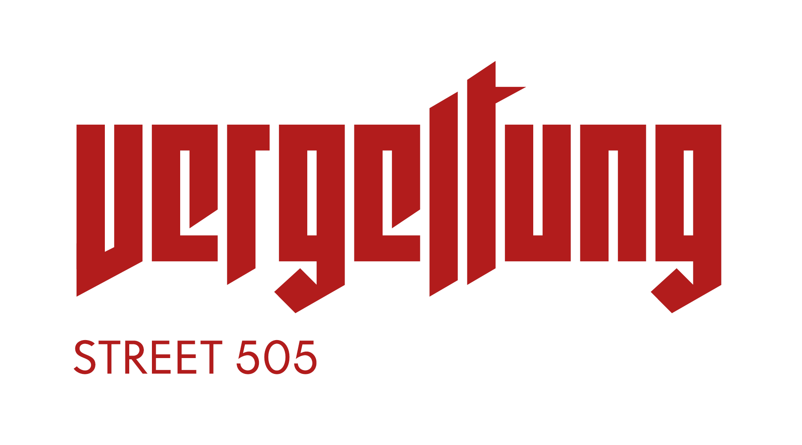
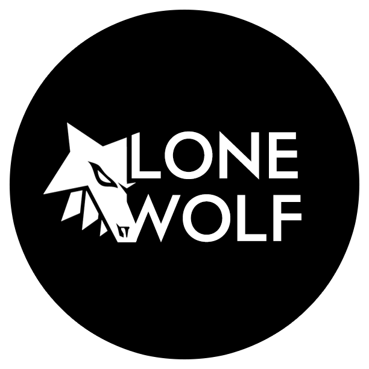

# Vergeltung

Progetto Unity esame sviluppo di videogiochi

<table>
  <tr>
    <th>
        
    </th>
    <th>
        
    </th>
  </tr>
</table>

## GDD Document
<a 
href="https://github.com/RayCatcherS/Vergeltung/blob/main/GDD/README.md" >
Documento Game Design
</a>

## Devlog
- [2 Capitolo](https://github.com/RayCatcherS/Vergeltung/blob/main/DevDiary/(2)diaryPullReqIssue%236-8-18-17/README.md)
- [3 Capitolo](https://github.com/RayCatcherS/Vergeltung/blob/main/DevDiary/(3)diaryPullReqIssue%2323/README.md)

## Note tecniche progetto
### Piattaforme di riferimento
- Windows 10
- Windows 11

### Configurazione sviluppo richiesta
- Richiesta installazione Blender versione >= 2.79 affinchè Unity riconosca i file .blend all'interno del progetto
- Richiesto pad Xbox

### Problemi noti:
- La versione Unity utilizzata manda in crash l'applicazione compilata(eseguibile) una volta avviata. Per risolvere tutti gli assets di tipo 'model' nell'inspector, nella sezione "model" devono avere la spunta attiva sulla voce "Read/Write"
